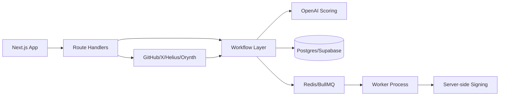

# Tech Stack And Architecture

## Product Summary

OrynthLabs is an operating-intelligence layer for founders: discover what is
worth building, understand the product, decide whether an onchain economy is
warranted, launch through Orynth, and keep monitoring afterwards.

**Orynth is a separate company** whose launchpad OrynthLabs integrates into.

The alpha is intentionally narrow:

- ingest signals across five evidence families (attention, builder, capital,
  consumer, market structure)
- assess readiness on six axes and recommend whether to tokenize at all
- keep sensitive signing logic on the backend
- support a worker-based architecture for anything that should not live in the
  web app

Scoring never treats one source as corroboration for itself: readiness requires
agreement across independent evidence families.

## Architecture Goals

The stack is chosen to optimize for:

- fast delivery of a credible alpha
- a clean separation between web UI and backend workflows
- safe handling of signing keys and other secrets
- flexibility to grow into separate workers and services later
- a data model that supports scoring, alerting, and historical analysis

## Recommended Stack

### Frontend

- Next.js 15 on the App Router
- TypeScript
- Tailwind CSS
- shadcn/ui for components

Why:

- ships quickly
- good fit for dashboard-style interfaces
- easy to keep the UX intentional without adding heavy frontend infrastructure

### Backend

- Next.js route handlers for alpha APIs
- Node workers for background jobs
- optional NestJS service later if the worker surface area grows

Why:

- keeps the first release simple
- avoids splitting the system too early
- still leaves a clear path for service extraction

### Database

- PostgreSQL
- Supabase for hosted Postgres, auth, and future platform support
- pgvector for embeddings and similarity search

Why:

- strong fit for a product that needs relational data and semantic lookups
- easy to combine operational records with signal history
- keeps AI features close to the data they depend on

### AI

- OpenAI API
- lightweight custom scoring workflows or LangGraph if orchestration becomes richer

Why:

- launch scoring and extraction can start simple
- AI outputs are easier to validate when wrapped in typed schemas

### Chain And Wallet

- Solana web3.js
- Solana Wallet Adapter for user-facing wallets
- Helius for RPC and enrichment

Why:

- Solana is the project chain target
- Helius gives a practical API layer for alpha signal work

### External Intelligence

- GitHub API
- X API/provider
- Orynth Partner API
- Birdeye or DexScreener for market data

Why:

- these are the primary off-chain signal sources for the alpha
- they map directly to the launch scoring use case

### Jobs And Queues

- Redis
- BullMQ for worker queues
- Trigger.dev if a hosted job layer becomes useful later

Why:

- keeps scoring, syncing, and signing flows asynchronous
- provides clear operational boundaries for retries and job visibility

### Analytics

- PostHog

Why:

- enough instrumentation for alpha usage and workflow analysis

### Hosting

- Vercel for the Next.js app
- Railway, Fly, or AWS for worker processes

Why:

- clean split between web and background compute
- easy to scale the pieces independently

### Secrets And Signing

- KMS or custody signer for production
- backend-only signing flow for pool creation or related authority actions

Why:

- the poolCreator private key must never be exposed to the frontend
- the launcher can sign as payer, but the authority key stays server-side

## Current Repo Layout

- `src/app` - app routes and API routes
- `src/components` - shared UI building blocks
- `src/lib` - types, validation, utilities, env handling
- `src/server` - backend-only clients, AI, queue, signing, and workflows
- `supabase` - SQL migrations and seed data
- `workers` - placeholder for process-based workers

## Core Data Flow

## Security Model

The critical rule is the signing boundary:

- `poolCreator` private key stays in backend/KMS/custody infrastructure
- `launcher` signs as payer
- frontend code never imports or stores private signing material

This rule applies to:

- API routes
- worker jobs
- any future transaction-building code

## Design Principles

- Keep alpha scope tight
- Prefer typed data contracts over loose JSON
- Put integration code behind server-only modules
- Make job processing observable
- Design for future extraction, but do not over-engineer now

## Practical Trade-offs

- Next.js route handlers are used first to move quickly, even though some backend logic may later move into dedicated services
- Supabase is used for convenience and speed, even though a future scale-up might split some concerns into separate databases or services
- Worker code is kept in-repo now, even though it may later become a standalone runtime
- AI scoring is initially lightweight and schema-validated instead of a large orchestration framework
